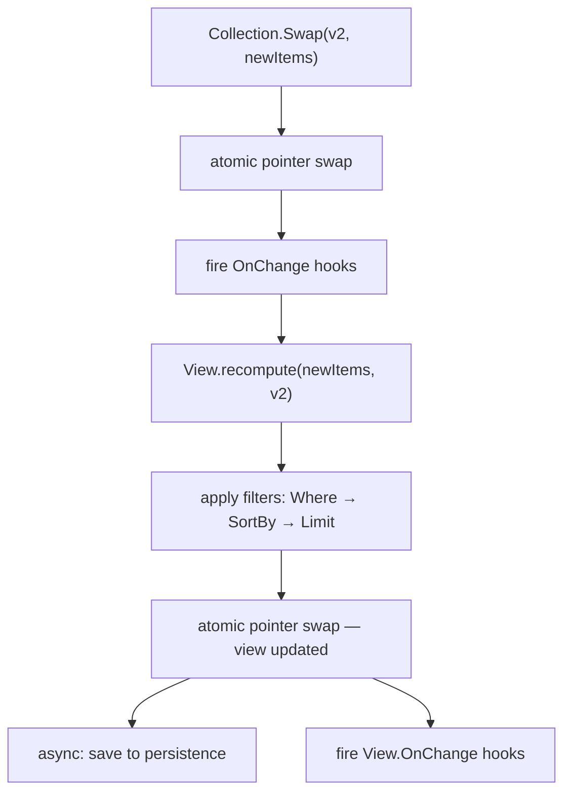

# Package: `config/`

Generic, thread-safe, in-memory config stores with querying, views, and translations.

## Collection[T] (`collection.go`)

Holds multiple items of type T. All reads are lock-free via `atomic.Pointer`.

```go
businesses := config.NewCollection[Business]("businesses")

// After manager syncs data:
all := businesses.All()                    // []Business (copy)
biz, ok := businesses.Find(func(b Business) bool { return b.ID == 42 })
food := businesses.FindMany(func(b Business) bool { return b.Category == "food" })
count := businesses.Count()
first, ok := businesses.First()
```

### Filter Pipeline

Chain filter options for complex queries:

```go
result := businesses.Filter(
    config.Where(func(b Business) bool { return b.Category == "food" }),
    config.SortBy(func(a, b Business) int { return cmp.Compare(a.Level, b.Level) }),
    config.Offset[Business](10),
    config.Limit[Business](5),
)
```

Options are applied in order. Each one transforms the slice and passes it to the next.

### OnChange Hooks

```go
businesses.OnChange(func(old, new []Business) {
    log.Printf("businesses updated: %d -> %d items", len(old), len(new))
})
```

Hooks fire synchronously after `Swap()`. If a hook panics, the panic is recovered and `Swap` returns an error. The data is already committed -- hooks cannot prevent a swap.

## Singleton[T] (`singleton.go`)

Holds exactly one value of type T.

```go
settings := config.NewSingleton[GameSettings]("game_settings")

if s, ok := settings.Get(); ok {
    fmt.Println(s.MaxPlayers)
}
```

Same `OnChange` and `Swap` semantics as Collection.

## View[T] (`view.go`)

Auto-updating materialized view. Define rules once -- the view recomputes whenever the source collection changes.

```go
foodByLevel := config.NewView("food-by-level", businesses,
    []config.FilterOption[Business]{
        config.Where(func(b Business) bool { return b.Category == "food" }),
        config.SortBy(func(a, b Business) int { return cmp.Compare(a.Level, b.Level) }),
        config.Limit[Business](100),
    },
)

// Reads hit the precomputed cache, not the full collection:
topFood := foodByLevel.All()
item, ok := foodByLevel.Find(func(b Business) bool { return b.ID == 42 })
count := foodByLevel.Count()
first, ok := foodByLevel.First()
items := foodByLevel.FindMany(func(b Business) bool { return b.Level > 3 })
filtered := foodByLevel.Filter(config.Limit[Business](10))
```

### How View Recomputation Works



The chain is synchronous from Collection.Swap through to the View update. By the time `Swap` returns, all views derived from that collection are already up-to-date.

### View OnChange

Views support their own OnChange hooks, independent of the source collection:

```go
foodByLevel.OnChange(func(old, new []Business) {
    log.Printf("food view: %d -> %d items", len(old), len(new))
})
```

### Persistence

Views can optionally persist their results for cross-replica sharing or warm starts:

```go
viewStore := rediscache.NewViewStore(redisClient)

view := config.NewView("food-sorted", businesses, filters,
    config.WithPersistence[Business](viewStore),
    config.WithErrorHandler[Business](func(name string, err error) {
        log.Printf("view %s persistence error: %v", name, err)
    }),
)
```

Persistence writes are **asynchronous** -- they do not block the view update. On startup, the view loads from persistence for a warm start before the first sync completes.

### ViewPersistence Interface

```go
type ViewPersistence interface {
    Save(ctx context.Context, key string, data []byte) error
    Load(ctx context.Context, key string) ([]byte, error)
}
```

Implementations: `rediscache.ViewStore` (`cache/redis/`), `memcache.ViewStore` (`cache/memory/`).

### ErrorFunc

Views accept an optional error callback for persistence failures:

```go
config.WithErrorHandler[Business](func(viewName string, err error) {
    log.Printf("view %s: %v", viewName, err)
})
```

Without this, persistence errors are silently ignored.

## SingletonView[T, R] (`view.go`)

Transforms a Singleton value into a different type. Auto-updates when the source singleton changes.

```go
featureFlags := config.NewSingletonView("features", settings,
    func(s GameSettings) FeatureFlags { return s.Features },
)

if flags, ok := featureFlags.Get(); ok {
    fmt.Println(flags.EnableNewUI)
}
```

### Persistence

SingletonView supports the same persistence pattern:

```go
features := config.NewSingletonView("features", settings, transformFn,
    config.WithSingletonViewPersistence[GameSettings, FeatureFlags](viewStore),
)
```

## CompositeView[T] (`view.go`)

Merges results from multiple Views into a single read endpoint:

```go
allSpecials := config.NewCompositeView("specials",
    func(a, b Product) bool { return a.ID == b.ID }, // dedup (nil to skip)
    foodView, drinkView,
)

items := allSpecials.All()   // merged, deduplicated
count := allSpecials.Count()
```

The dedup function is optional. If nil, results are concatenated without deduplication.

## IndexedView[T, K] (`index.go`)

Auto-updating grouped view that maintains a `map[K][]T` index. Recomputes on source collection changes.

```go
byCategory := config.NewIndexedView("by-category", businesses,
    func(b Business) string { return b.Category },
)

foodBusinesses := byCategory.Get("food")   // []Business, O(1) lookup
allCategories := byCategory.Keys()         // []string
count := byCategory.Count()                // number of unique keys
countFood := byCategory.CountFor("food")   // items in "food"
exists := byCategory.Has("food")           // bool
allGroups := byCategory.All()              // map[string][]Business (copy)
```

### Persistence and Error Handling

```go
byCategory := config.NewIndexedView("by-category", businesses, keyFn,
    config.WithIndexPersistence[Business, string](viewStore),
    config.WithIndexErrorHandler[Business, string](func(name string, err error) {
        log.Printf("index %s: %v", name, err)
    }),
)
```

### OnChange

```go
byCategory.OnChange(func(old, new map[string][]Business) {
    log.Printf("categories changed: %d -> %d groups", len(old), len(new))
})
```

## IndexedViewT[T, K, V] (`index.go`)

Like IndexedView but with a value transform -- groups items by key and extracts a different value type, producing `map[K][]V`.

```go
levelsByBiz := config.NewIndexedViewT("levels-by-biz", businesses,
    func(b Business) string { return b.Name },       // key extractor
    func(b Business) []Level { return b.Levels },     // value extractor
)

pizzaLevels := levelsByBiz.Get("Pizza Place") // []Level
count := levelsByBiz.CountFor("Burger Joint")
allKeys := levelsByBiz.Keys()
```

Values from all source items with the same key are concatenated.

### Persistence and Error Handling

```go
levelsByBiz := config.NewIndexedViewT("levels-by-biz", businesses, keyFn, valueFn,
    config.WithIndexTPersistence[Business, string, Level](viewStore),
    config.WithIndexTErrorHandler[Business, string, Level](errorHandler),
)
```

## Translations (`translation.go`)

Helpers for working with translated collections.

### In-memory lookup

```go
// Find single translation
tr, ok := config.FindTranslation(product.Translations,
    func(t ProductI18n) string { return t.LanguagesCode },
    "en-US",
)

// With fallback chain
tr, ok := config.FindTranslationWithFallback(product.Translations,
    func(t ProductI18n) string { return t.LanguagesCode },
    "de-DE", "en-US", "en",
)

// As a map
trMap := config.TranslationMap(product.Translations,
    func(t ProductI18n) string { return t.LanguagesCode },
)
name := trMap["en-US"].Name
```

### TranslatedView

Creates a language-specific flattened view that auto-updates:

```go
enProducts := config.NewTranslatedView("products-en", products,
    func(p Product) LocalizedProduct {
        tr, _ := config.FindTranslation(p.Translations,
            func(t ProductI18n) string { return t.LanguagesCode },
            "en-US",
        )
        return LocalizedProduct{
            ID: p.ID, Name: tr.Name, Description: tr.Description,
        }
    },
)

// enProducts.All() returns []LocalizedProduct
// Auto-updates when source products collection changes
```

### Persistence

TranslatedView supports the same persistence pattern as other views:

```go
enProducts := config.NewTranslatedView("products-en", products, transformFn,
    config.WithTranslatedViewPersistence[Product, LocalizedProduct](viewStore),
    config.WithTranslatedViewErrorHandler[Product, LocalizedProduct](func(name string, err error) {
        log.Printf("translated view %s: %v", name, err)
    }),
    config.WithTranslatedViewPersistenceTimeout[Product, LocalizedProduct](5*time.Second),
)
```

## RelatedView (`related.go`)

Extracts and flattens nested M2M/O2M data from a parent Collection into a queryable view:

```go
// Given: businesses have M2M levels populated via WithFields("*", "levels.*")
allLevels := config.NewRelatedView("business-levels", businesses,
    func(b Business) []Level { return b.Levels },
    config.WithDedup[Business, Level](func(a, b Level) bool { return a.ID == b.ID }),
)

// Query the flattened related items directly.
expensive := allLevels.Filter(
    config.Where(func(l Level) bool { return l.Price > 100 }),
)
level, ok := allLevels.Find(func(l Level) bool { return l.ID == 5 })
```

`WithDedup` removes duplicate related items that appear under multiple parents (common with M2M). Note: deduplication uses linear search per item (O(n²)). For large collections, consider deduplicating in the extract function instead.

### Error Handling

```go
allLevels := config.NewRelatedView("levels", businesses, extractFn,
    config.WithRelatedViewErrorHandler[Business, Level](func(name string, err error) {
        log.Printf("related view %s: %v", name, err)
    }),
)
```

## Close and Version

All view types (`View`, `SingletonView`, `IndexedView`, `IndexedViewT`, `TranslatedView`, `RelatedView`) support:

- **`Close()`** — unsubscribes from the source. The view stops recomputing on source changes. Reads remain valid but return stale data. Safe to call multiple times.
- **`Version()`** — returns the current snapshot version, matching the source's version at the time of the last recomputation.

```go
view := config.NewView("items", collection, filters)
defer view.Close()

ver := view.Version()
```

## ReadableCollection Interface

`ReadableCollection[T]` is a read-only interface implemented by `Collection[T]`, `View[T]`, `TranslatedView[T, R]`, and `RelatedView[T, R]`. Use it to accept any of these types without exposing `Swap()`:

```go
func processItems(src config.ReadableCollection[Product]) {
    for _, p := range src.All() {
        // works with Collection, View, TranslatedView, or RelatedView
    }
}
```

`ReadableSingleton[T]` provides the same for `Singleton[T]`.

## Version (`version.go`)

Opaque version type based on `date_updated` timestamps. RFC3339 format ensures deterministic comparison across replicas -- same source data produces the same version string everywhere.

## Full View Type Summary

| View Type | Source | Output | Key Feature |
|---|---|---|---|
| `View[T]` | `Collection[T]` | `[]T` | Filter + sort + limit pipeline |
| `SingletonView[T, R]` | `Singleton[T]` | `R` | Type transformation |
| `CompositeView[T]` | Multiple `View[T]` | `[]T` | Merge with dedup |
| `IndexedView[T, K]` | `Collection[T]` | `map[K][]T` | Grouped by key |
| `IndexedViewT[T, K, V]` | `Collection[T]` | `map[K][]V` | Grouped + value transform |
| `TranslatedView` | `Collection[T]` | `[]R` | Language-specific flatten |
| `RelatedView` | `Collection[T]` | `[]R` | Flatten nested M2M/O2M |
