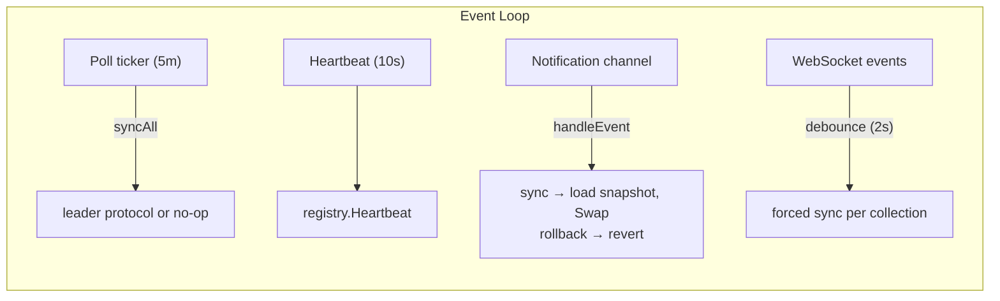

# Package: `manager/`

The Manager is the orchestrator that ties everything together. It manages the full lifecycle of config synchronization.

## Creating a Manager

```go
mgr := manager.New(
    store,        // storage.Storage (required)
    notifier,     // notify.Channel (required)
    reg,          // registry.Registry (required)
    manager.Options{
        PollInterval:             5 * time.Minute,  // how often to check the source
        HeartbeatInterval:        10 * time.Second,  // how often to heartbeat
        WaitConfirmationsTimeout: 30 * time.Second,  // how long leader waits for followers
        AdvisoryLockKey:          987654321,          // Postgres advisory lock key
        ServiceName:              "my-service",       // groups replicas in registry
        WSPollInterval:           15 * time.Minute,   // poll interval when WS is active
        WSDebounce:               2 * time.Second,    // debounce window for WS events
        RequireUnanimousApply:    false,              // opt in for strict 2PC (see below)
        PrepareTTL:               0,                  // follower staged TTL (default: 2 × WaitConfirmationsTimeout)
    },
    manager.WithLogger(logger),                       // optional
    manager.WithCache(redisCache, cache.ReadWriteThrough), // optional
    manager.WithInstanceID("custom-id"),              // optional (auto-generated UUID by default)
    manager.WithWebSocket(wsClient),                  // optional, enables real-time sync
)
```

## Source-Agnostic Registration

The manager accepts any data source via the `source.CollectionSource[T]` / `source.SingletonSource[T]` interfaces:

```go
// Source interfaces (defined in source/source.go):
type CollectionSource[T any] interface {
    List(ctx context.Context) ([]T, error)
    LastModified(ctx context.Context) (time.Time, error)
}

type SingletonSource[T any] interface {
    Get(ctx context.Context) (*T, error)
    LastModified(ctx context.Context) (time.Time, error)
}
```

### Directus Shorthand

For Directus sources, convenience wrappers create the source adapter automatically:

```go
// Multi-item collection
businesses := config.NewCollection[Business]("businesses")
businessItems := directus.NewItems[Business](dc, "businesses")
manager.RegisterCollection(mgr, businesses, businessItems,
    directus.WithFields("*", "translations.*"),  // default fetch options
)

// Singleton
settings := config.NewSingleton[GameSettings]("game_settings")
settingsSingleton := directus.NewSingleton[GameSettings](dc, "game_settings")
manager.RegisterSingleton(mgr, settings, settingsSingleton)
```

### Generic Source Registration

For any backend (not Directus):

```go
// Custom collection source.
manager.RegisterCollectionSource(mgr, products, &myCustomAPI{})

// Custom singleton source.
manager.RegisterSingletonSource(mgr, settings, &mySettingsAPI{})
```

The `...QueryOption` args on `RegisterCollection`/`RegisterSingleton` are applied to every Directus fetch -- use them for relational fields, translations, etc.

## Strict Consistency (2PC)

Set `Options.RequireUnanimousApply = true` to run the **two-phase commit** variant of the sync protocol. In this mode a new version is applied by **every** alive replica or by **none** — a single follower that cannot prepare aborts the round and the leader retries on the next poll/WS cycle.

```go
mgr := manager.New(store, notifier, reg, manager.Options{
    ServiceName:              "my-service",
    RequireUnanimousApply:    true,
    WaitConfirmationsTimeout: 10 * time.Second, // prepare phase timeout
    PrepareTTL:               30 * time.Second, // how long followers hold staged state (default: 2 × WaitConfirmationsTimeout)
})
```

Trade-off: a chronically broken replica blocks config updates for the entire cluster until it recovers or is removed from the registry. All replicas of the same service must use the same value for `RequireUnanimousApply` — mixed-mode clusters are unsupported.

See [sync-protocol.md](./sync-protocol.md#two-phase-commit-mode-strict-consistency) for the full protocol and operational notes.

## Default Values

Apply default values to fields that arrive as zero values from the data source:

```go
manager.RegisterCollectionSource(mgr, products, productSource,
    manager.WithCollectionDefaults(func(p Product) Product {
        if p.Currency == "" {
            p.Currency = "USD"
        }
        if p.MaxStock == 0 {
            p.MaxStock = 100
        }
        return p
    }),
)

manager.RegisterSingletonSource(mgr, settings, settingsSource,
    manager.WithSingletonDefaults(func(s Settings) Settings {
        if s.Locale == "" {
            s.Locale = "en-US"
        }
        return s
    }),
)
```

Behavior:

- Defaults run after fetch/deserialize and **before** validation. The validator sees data with defaults already applied.
- Applied on every path: leader fetch, follower snapshot load, 2PC prepare/stage.
- The function receives each item by value and returns the modified copy.

## Pre-Apply Validation

Attach a validator at registration time to reject upstream data before it is swapped into memory:

```go
manager.RegisterCollectionSource(mgr, products, productSource,
    manager.WithCollectionValidator(func(items []Product) error {
        if len(items) == 0 {
            return errors.New("empty product list")
        }
        for _, p := range items {
            if p.Price < 0 {
                return fmt.Errorf("invalid price for %s: %d", p.SKU, p.Price)
            }
        }
        return nil
    }),
)

manager.RegisterSingletonSource(mgr, settings, settingsSource,
    manager.WithSingletonValidator(func(s *Settings) error {
        if s.Theme == "" { return errors.New("missing theme") }
        return nil
    }),
)
```

Behavior:

- Validator runs after fetch/deserialize and **before** `Swap()`. Non-nil error → no swap, version not advanced, snapshot not activated.
- Errors are wrapped with `manager.ErrValidationFailed` for `errors.Is` matching.
- The cluster stays on the **previous** known-good version. If no good version was ever applied (validator failed on first sync, or the persisted snapshot fails the current validator on startup), the collection stays empty until a valid version arrives.
- WebSocket events do **not** carry payload — they trigger a re-fetch. After a rejection, the next WS event or poll cycle re-fetches the **current** source state. Once the source data is fixed, the new version is applied automatically.
- Each `(collection, version)` failure is logged at most once. The dedup state resets on the next successful apply, so subsequent invalid versions are still surfaced.
- `Metrics.ValidationFailed(collection)` fires on each rejection.

In `RequireUnanimousApply` (2PC) mode:

- A leader-side rejection skips the round entirely (no snapshot, no `prepare` event published).
- A follower-side rejection logs `prepare_failed` in the apply log → leader aborts the round → no replica applies. The leader's "round aborted" warning is also deduped per `(collection, version)` so retries do not flood the log.
- Every replica should typically install the **same** validator — a one-sided rejection blocks cluster-wide updates until the source is fixed.

## Starting

```go
ctx, cancel := context.WithCancel(context.Background())
go func() {
    if err := mgr.Start(ctx); err != nil {
        log.Fatal(err)
    }
}()
```

`Start` is blocking. It runs until the context is cancelled or `Stop()` is called.

### What Start does

1. Registers this instance in the registry
2. Loads from cache (if enabled)
3. Loads from Postgres storage (active snapshots)
4. Performs initial sync from the data source
5. Subscribes to notification channel + WebSocket
6. Enters event loop: poll ticker + heartbeat + notifications + WS (debounced)

## WebSocket Integration

When configured with `WithWebSocket(ws)`, the manager subscribes to Directus WebSocket events for all registered collections.

```go
ws := directus.NewWSClient("https://directus.example.com", "token")
mgr := manager.New(store, notifier, reg, opts,
    manager.WithWebSocket(ws),
)
```

### How it works

1. On Start, the manager subscribes to WS events for all registered collection names
2. Each subscription uses a UID (`sub_{collection}`) for event-to-collection mapping
3. WS events trigger **forced sync** (skip version comparison)
4. Polling continues at `WSPollInterval` (default 15m) as a safety net

### Fallback behavior

If the WebSocket connection drops:
1. The WS channel closes
2. Manager sets `wsEvents = nil` (disables the select case)
3. Poll ticker resets to normal `PollInterval`
4. No panics, no goroutine leaks -- seamless fallback

### Non-fatal subscription failure

If WebSocket subscription fails at startup, the manager logs a warning and continues with polling only.

## Debounce Configuration

WebSocket events are debounced per collection to prevent mass rebuilds during bulk operations.

```
WS: create item 1  -> queue "products", start 2s timer
WS: create item 2  -> reset timer
... 100 more events ...
timer fires -> sync "products" ONCE -> one refetch -> one view recompute
```

### Options

| Setting | Default | Description |
|---|---|---|
| `WSDebounce` | 2s | Debounce window duration |
| `WSDebounce = 0` (in config) | Becomes 2s | Uses default (set negative to disable) |
| `WSDebounce < 0` | Becomes 0 | Disabled -- sync immediately on every event |

The debounce accumulates changed collections. When the timer fires, all accumulated collections are synced in one batch.

## Event Loop



## Type Erasure

The Manager is not generic, but it works with any `Config[T]`. This is achieved through the `registrable` interface:

```go
type registrable interface {
    name() string
    version() config.Version
    fetchVersion(ctx) (time.Time, error)
    fetchAndSwap(ctx, version) ([]byte, error)
    swapFromBytes(version, data) error
}
```

`RegisterCollection[T]` wraps `config.Collection[T]` + `source.CollectionSource[T]` into a `collectionReg[T]` that satisfies `registrable`. Same pattern for singletons. The generic type parameter is captured at registration time and erased from the Manager's perspective.

## Manual Sync Mode

Set `Options.ManualSyncOnly = true` to disable automatic polling and WebSocket-triggered syncs. The manager only syncs from the data source when `SyncNow` is called explicitly.

```go
mgr := manager.New(store, notifier, reg, manager.Options{
    ServiceName:    "my-service",
    ManualSyncOnly: true,
})

// Wire to an HTTP endpoint:
http.HandleFunc("/config/sync", func(w http.ResponseWriter, r *http.Request) {
    mgr.SyncNow(r.Context())
    w.WriteHeader(http.StatusOK)
})
```

What stays active in manual mode:
- Startup sequence: cache → storage loading (fast init with existing data)
- **Bootstrap sync**: if cache and storage are empty (first deploy), one initial sync runs automatically so the service starts with valid config
- Heartbeats and instance registry
- Notification listener (followers still receive sync events from leader)
- Follower self-heal (catch up to manually triggered leader syncs)
- Maintenance (snapshot/instance GC)

What is disabled:
- Poll ticker (no automatic version checks)
- WebSocket subscription (no real-time change detection)
- Automatic sync on startup when data already exists in cache/storage

## Force Sync

```go
mgr.SyncNow(ctx) // triggers immediate sync cycle
```

## Shutdown

```go
mgr.Stop()          // signals shutdown
// or cancel the context passed to Start
```

On shutdown, the manager deregisters from the instance registry.

## Options Reference

| Option | Default | Description |
|---|---|---|
| `PollInterval` | 5m | How often to check the source for changes |
| `HeartbeatInterval` | 10s | How often to heartbeat to registry |
| `WaitConfirmationsTimeout` | 30s | Leader waits this long for follower confirmations |
| `AdvisoryLockKey` | 987654321 | Postgres advisory lock key for leader election |
| `WSPollInterval` | 15m | Poll interval when WebSocket is active |
| `WSDebounce` | 2s | Debounce window for WS events |
| `ServiceName` | (required) | Groups replicas in the instance registry |
| `ManualSyncOnly` | false | Disable auto polling/WS; sync only via `SyncNow` |

## Manager Options (functional)

| Option | Description |
|---|---|
| `WithLogger(logger)` | Set the manager logger |
| `WithCache(cache, strategy)` | Enable caching with a specific strategy |
| `WithInstanceID(id)` | Override auto-generated UUID instance ID |
| `WithWebSocket(ws)` | Enable real-time change detection |
| `WithMetrics(m)` | Receive observability events |

### Per-Registration Options

| Option | Description |
|---|---|
| `WithCollectionDefaults(fn)` | Per-item defaults for `RegisterCollectionSource` (see [Default Values](#default-values)) |
| `WithSingletonDefaults(fn)` | Defaults for `RegisterSingletonSource` |
| `WithCollectionValidator(fn)` | Pre-apply validator for `RegisterCollectionSource` (see [Pre-Apply Validation](#pre-apply-validation)) |
| `WithSingletonValidator(fn)` | Pre-apply validator for `RegisterSingletonSource` |
