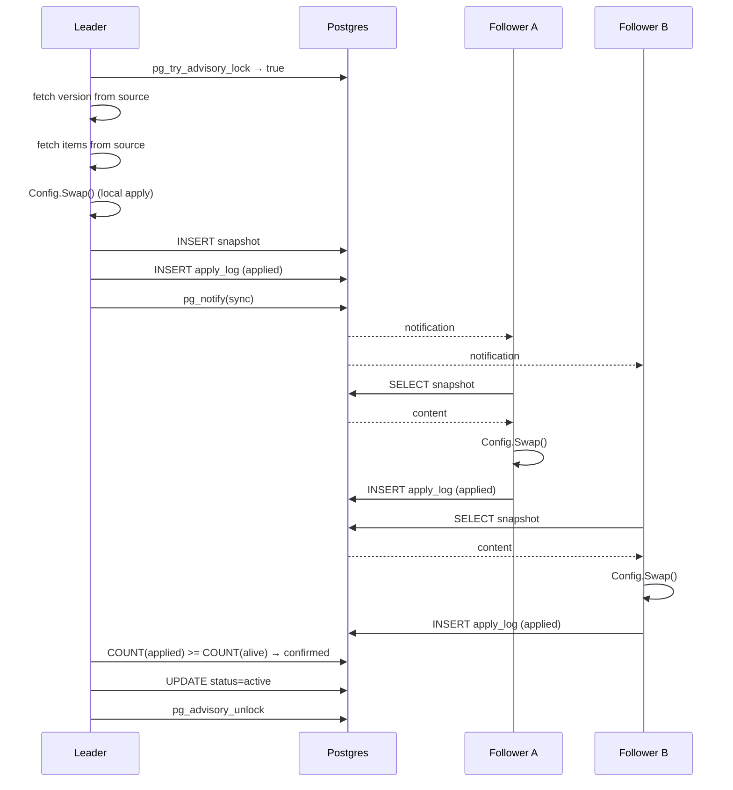
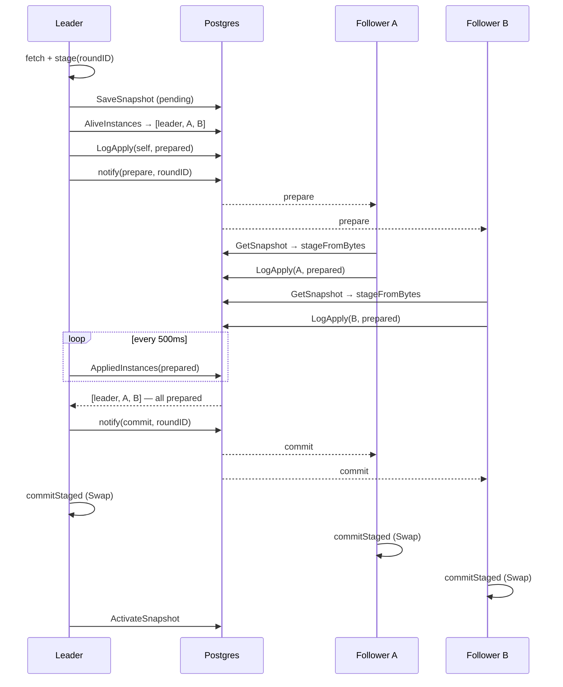

# Sync Protocol

This document explains how config changes propagate from the data source to all application replicas.

## Participants

- **Data Source** — the source of truth for all config data (e.g. Directus, custom API)
- **Leader** — the replica that holds the Postgres advisory lock; performs fetches from the source
- **Followers** — all other replicas; receive data via storage snapshots
- **Postgres** — stores snapshots, apply logs, advisory locks, and instance registry
- **Notify channel** — delivers sync/rollback events (Postgres LISTEN/NOTIFY or Redis Pub/Sub)

## Leader Election

Leader election uses a **Postgres session-level advisory lock** (`pg_try_advisory_lock`).

```
Replica A: pg_try_advisory_lock(987654321) → true  (leader)
Replica B: pg_try_advisory_lock(987654321) → false (follower)
Replica C: pg_try_advisory_lock(987654321) → false (follower)
```

- The lock is attempted at the start of each poll cycle
- If acquired → run leader protocol
- If not acquired → do nothing (follower reacts to notifications)
- Lock is held for the duration of one sync cycle, then released
- If the leader crashes, Postgres automatically releases the session lock

The advisory lock key is configurable via `Options.AdvisoryLockKey`. All instances of the same service must use the same key.

## Leader Protocol

On each poll cycle (default: every 5 minutes), the leader does this for each registered collection:

```
1. VERSION CHECK
   GET /items/{collection}?sort=-date_updated&limit=1&fields=date_updated
   → Parse max(date_updated) as new version
   → Compare with current in-memory version
   → If equal: skip (no change)

2. FETCH
   GET /items/{collection}  (with configured fields, deep, filters)
   → Unmarshal into []T
   → Call Config[T].Swap(newVersion, items)
   → This atomically updates in-memory data + fires OnChange hooks + recomputes Views

3. PERSIST
   INSERT INTO config_snapshots (collection, version, content, status='pending')
   → If cache enabled: write to Redis (sync or async based on strategy)

4. SELF-LOG
   INSERT INTO config_apply_log (instanceID, collection, version, 'applied')

5. NOTIFY
   pg_notify('config_sync', '{"action":"sync","collection":"businesses","version":"2025-01-02T00:00:00Z"}')
   → Or Redis PUBLISH if using Redis notify channel

6. WAIT FOR CONFIRMATIONS
   Loop (500ms interval, 30s timeout):
     SELECT COUNT(*) FROM config_apply_log WHERE collection=$1 AND version=$2 AND status='applied'
     SELECT COUNT(*) FROM config_instances WHERE service_name=$1 AND last_heartbeat > NOW() - 30s
     → If applied_count >= alive_count: all replicas confirmed

7. ACTIVATE
   UPDATE config_snapshots SET status='active' WHERE collection=$1 AND version=$2
   UPDATE config_snapshots SET status='inactive' WHERE collection=$1 AND status='active' AND version!=$2
```

## Follower Protocol

Followers listen on the notification channel. When they receive a sync event:

```
1. RECEIVE EVENT
   {"action": "sync", "collection": "businesses", "version": "2025-01-02T00:00:00Z"}

2. LOAD SNAPSHOT
   SELECT content FROM config_snapshots WHERE collection=$1 AND version=$2

3. APPLY
   Unmarshal content into []T
   Call Config[T].Swap(version, items)
   → Triggers OnChange hooks + View recomputes (same as leader)

4. LOG
   INSERT INTO config_apply_log (instanceID, collection, version, 'applied')
```

## Startup Sequence

When a replica starts, it loads data in this priority order:

```
1. REGISTER
   INSERT INTO config_instances (instanceID, serviceName)

2. LOAD FROM CACHE (optional, if ReadThrough/ReadWriteThrough strategy)
   Redis GET director:{collection}
   → Fastest: no Postgres or Directus needed
   → May be slightly stale depending on TTL

3. LOAD FROM STORAGE
   SELECT content FROM config_snapshots WHERE collection=$1 AND status='active'
   → Only if cache miss or cache version is older

4. INITIAL SYNC (leader only)
   Full leader protocol for all registered collections

5. START EVENT LOOPS
   - Poll ticker (default 5m)
   - Heartbeat ticker (default 10s)
   - Notification listener
```

This means replicas can serve requests immediately after step 2 or 3, before Directus is even contacted.

## Sequence Diagram



## Rollback

If the confirmation timeout expires before all replicas confirm:

1. Leader marks the snapshot as `failed`
2. Leader publishes a `rollback` event
3. All replicas (including leader) load the previous `active` snapshot from storage
4. All replicas swap back to the old data

## Instance Registry & Heartbeat

Each replica registers itself in `config_instances` and sends heartbeats every 10 seconds. The leader uses `AliveCount` (instances with heartbeat newer than 30s) to know how many confirmations to expect.

If a replica dies without deregistering, its heartbeat goes stale and it's excluded from the confirmation count within 30 seconds.

## WebSocket-Triggered Sync

When `WithWebSocket(ws)` is configured, the manager subscribes to Directus WebSocket events for all registered collections. Each subscription uses a UID (`sub_{collection}`) to map events back to collections (Directus WS events don't include the collection name).

### How it differs from polling

| Aspect | Poll-based | WebSocket-triggered |
|---|---|---|
| Latency | Up to PollInterval (default 5m) | Near-instant |
| Version check | Fetches `max(date_updated)`, skips if unchanged | **Forced sync** — skips version comparison |
| Poll interval | Normal (5m) | Safety-net only (15m) |
| Failure mode | Continues polling | Falls back to normal polling |

### Forced sync (`leaderSyncForced`)

When a WebSocket event arrives, we **know** something changed — no need to compare versions. The forced sync:

1. Fetches current version (still needed for snapshot labeling)
2. **Skips** the "is version equal?" check
3. Full fetch → swap → snapshot → notify (same as regular sync)

This is critical because `date_updated` may not be populated for items created via the API when the special metadata isn't applied (a known Directus 11 quirk with API-created fields).

### WS event format

Directus sends subscription events as:

```json
{
    "type": "subscription",
    "uid": "sub_businesses",
    "event": "create",
    "data": [{"id": 1, "name": "New Item", ...}]
}
```

The `init` event (subscription confirmation) is filtered out. Only `create`, `update`, and `delete` events are processed.

### Fallback behavior

If the WebSocket connection drops:
1. The WS channel closes
2. Manager sets `wsEvents = nil` (disables the select case)
3. Poll ticker resets to normal `PollInterval`
4. No panics, no goroutine leaks — seamless fallback

## Two-Phase Commit Mode (strict consistency)

The default sync protocol is **eventually-consistent**: a slow or broken follower cannot block the leader from advancing, so different replicas may briefly (or, if data stops changing, indefinitely) run on different versions.

For workloads that require the cluster-wide invariant *"at any moment every alive replica runs the same config version"*, opt in to **two-phase commit** via `Options.RequireUnanimousApply = true`.

### Guarantee

- Either **all** alive replicas transition `vN → vN+1`, or **nobody** does.
- A broken replica cannot permanently diverge.
- There is a brief skew window (fractions of a second up to a few seconds) between when the leader publishes `commit` and each follower actually performs its local `Swap()`. This is inherent to distributed systems — *true* simultaneity requires synchronized clocks + scheduled activation time.

### Trade-off

- **A single chronically-broken replica blocks ALL config updates cluster-wide.** The leader retries on each poll / WS cycle but will keep aborting until every replica can prepare.
- Dead replicas that have not deregistered (kill −9, OOM, network partition) block progress for up to `registry.staleThreshold` (default 30 s) after their last heartbeat, because they still appear in `AliveInstances` during that window.
- **Mixed-mode clusters are unsupported.** Every replica of the same service must agree on `RequireUnanimousApply`. A mix of 2PC and eventually-consistent managers will violate the invariant.

### Protocol

On each leader round (poll or WS-triggered), for each collection:

```
1.  VERSION CHECK            same as eventually-consistent mode
2.  STAGE (no swap yet)
    - Leader fetches all items, serializes, stores in-memory staged slot
      keyed by a fresh roundID; in-memory config is NOT updated yet.
3.  PERSIST SNAPSHOT
    INSERT INTO config_snapshots (..., status='pending')
3a. RESET APPLY LOG
    DELETE FROM config_apply_log WHERE collection=... AND version=...
    - Wipes any stale 'prepared'/'committed' rows from a prior aborted
      round of the same version. Safe under the advisory lock.
4.  TARGET SET
    - Leader records AliveInstances(service) as the target set.
    - Leader self-logs "prepared" in config_apply_log.
5.  PUBLISH PREPARE
    pg_notify('{"action":"prepare","collection":...,"version":...,"round_id":...}')
6.  WAIT FOR PREPARES (loop every 500ms until WaitConfirmationsTimeout)
    - alive    = AliveInstances(service) re-snapshotted every tick
    - failed   = AppliedInstances(collection, version, 'prepare_failed')
    - prepared = AppliedInstances(collection, version, 'prepared')
    - If any (target ∩ alive) replica is in failed → abort immediately
    - If every (target ∩ alive) replica is in prepared → proceed
    - On timeout → abort
7a. ON ABORT
    - Publish {"action":"abort","round_id":...}
    - Followers discard staged snapshot
    - Leader marks snapshot as 'failed'
    - Leader returns error; next poll/WS cycle will retry
7b. ON COMMIT
    - Publish {"action":"commit","round_id":...}
    - Leader swaps staged value live, logs 'committed'
    - Cache write happens AFTER commit (an aborted round never warms cache)
    - ActivateSnapshot → this version becomes authoritative for new replicas
```

### Follower handlers

- `prepare` → load snapshot from storage, deserialize into a staged slot keyed by `roundID`, log `prepared` or `prepare_failed`. Staged slots have a TTL (default `2 × WaitConfirmationsTimeout`) after which they're dropped.
- `commit` → swap the staged value live under the matching `roundID`. If the staged slot is missing (TTL expired, manager restart), fall back to reloading from storage — the follower already committed to the invariant when it logged `prepared`.
- `abort` → drop the staged slot. No apply-log entry is written (an aborted round leaves no trace except the `failed` snapshot).

### Why target-by-instance-id (not AliveCount)

The legacy protocol uses `AliveCount`. For 2PC that's insufficient: a replica that gets SIGKILLed continues to appear in the registry for up to `staleThreshold`. With count-based comparisons the leader would wait for a phantom, time out, and abort every round during that window.

The 2PC protocol snapshots `AliveInstances → []instanceID` at round start and checks *per instance* on every tick. If an instance disappears from `AliveInstances` during the wait (heartbeat went stale), it drops out of the effective target. The round completes as long as all *currently* alive members of the target set have prepared.

### Startup

`loadFromCache` / `loadFromStorage` are unchanged — they load the last `active` snapshot, which under 2PC is always a fully committed version. A replica that joins mid-round sees only the pre-round active version until it subscribes and participates in the next round.

### Configuration

```go
manager.Options{
    ServiceName:              "my-service",
    RequireUnanimousApply:    true,                     // opt in
    WaitConfirmationsTimeout: 10 * time.Second,         // prepare timeout (default: 30s)
    PrepareTTL:               30 * time.Second,         // follower staged TTL (default: 2 × WaitConfirmationsTimeout)
}
```

### Sequence diagram (2PC, happy path)



### Rolling Deployments

2PC is sensitive to instance churn. During a rolling update, dying pods remain in `AliveInstances` until their heartbeat goes stale (`staleThreshold`, default 30s). The leader includes them in the prepare target set, they don't respond, and the round aborts on timeout.

With 15 pods and `MaxUnavailable=1`, this can block all config updates for the duration of the rollout.

**Mitigation:** call `manager.Stop()` on `SIGTERM`. Stop deregisters the instance from the registry **before** stopping the event loop, removing it from `AliveInstances` immediately. This reduces the phantom window from 30s to effectively zero.

See [rolling-deployment.md](./rolling-deployment.md) for full guidance.

### Observability

Implement the 2PC-specific `Metrics` methods to track round health:
- `PreparePhaseStarted(collection, roundID)` / `PreparePhaseSucceeded` / `PreparePhaseFailed(reason)` — reason is `"prepare_failed"` or `"timeout"`.
- `FollowerPrepared(collection)` / `FollowerPrepareFailed(collection, err)` — per-follower prepare outcomes.
- `StagedDropped(collection, reason)` — reason is `"abort"` or `"ttl"`.

## Maintenance: garbage-collecting old data

By default, snapshots and registry rows accumulate forever — `director` keeps
the full history so any replica can recover an arbitrary version, and dead
replicas that never called `Deregister` linger in `config_instances` until
manually cleaned.

For long-running clusters, opt into periodic garbage collection via
`manager.Options`:

```go
manager.Options{
    ServiceName:         "my-service",
    SnapshotRetention:   90 * 24 * time.Hour, // keep snapshots ~3 months
    InstanceRetention:   24 * time.Hour,      // prune dead replicas after 1 day
    MaintenanceInterval: time.Hour,            // run GC hourly (default)
}
```

### Behavior

- A maintenance ticker fires every `MaintenanceInterval`. Only the leader
  (the manager that holds the advisory lock at that instant) actually performs
  the deletes — followers see `ErrLockNotAcquired` and exit immediately, so
  there is no stampede.
- **Snapshots:** every snapshot whose `created_at < now() - SnapshotRetention`
  AND `status != 'active'` is removed. Apply-log rows for the deleted snapshot
  versions are removed in the same transaction. The currently-active snapshot
  is **always** preserved regardless of age, so the cluster can always recover
  the authoritative version (e.g. after a restart that loses cache).
- **Instances:** every row in `config_instances` whose `last_heartbeat <
  now() - InstanceRetention` is removed. `AliveCount` / `AliveInstances`
  already filter by their own (much shorter) staleness window for sync
  correctness, so this only affects long-dead rows.
- Setting either retention to `0` (the default) disables that GC; setting both
  to `0` skips creating the maintenance ticker entirely.

### Choosing values

- `SnapshotRetention` should be at least a few times your typical operational
  rollback window. With 5-minute polls and frequent updates you may produce
  hundreds of snapshots per day; 90 days strikes a balance between the ability
  to investigate old states and database bloat.
- `InstanceRetention` must be **far** larger than `HeartbeatInterval` (default
  10s) and the registry stale threshold (default 30s) — pick at least 1 hour
  to be safe against transient delays. The active sync protocol uses its own
  staleness window, so this value only controls how long dead rows stick
  around for inspection / accounting.

### Mocks

Custom `storage.Storage` and `registry.Registry` implementations must
implement `DeleteOldSnapshots(ctx, olderThan)` and `DeleteStaleInstances(ctx,
olderThan)` respectively. A no-op implementation (return `0, nil`) is safe if
you don't want GC for that backend.
