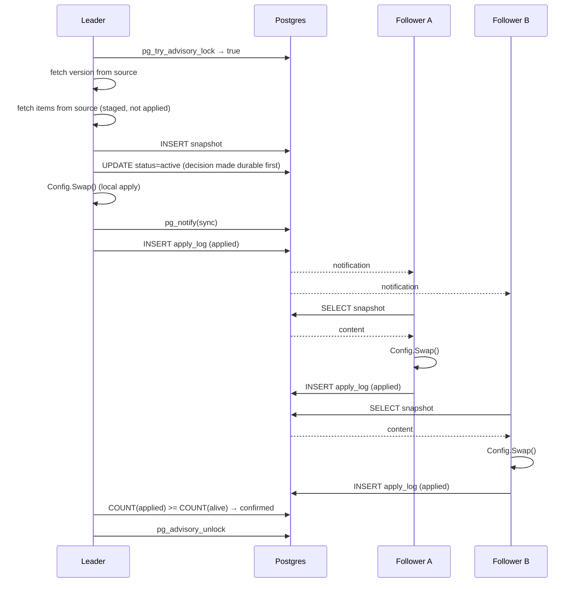
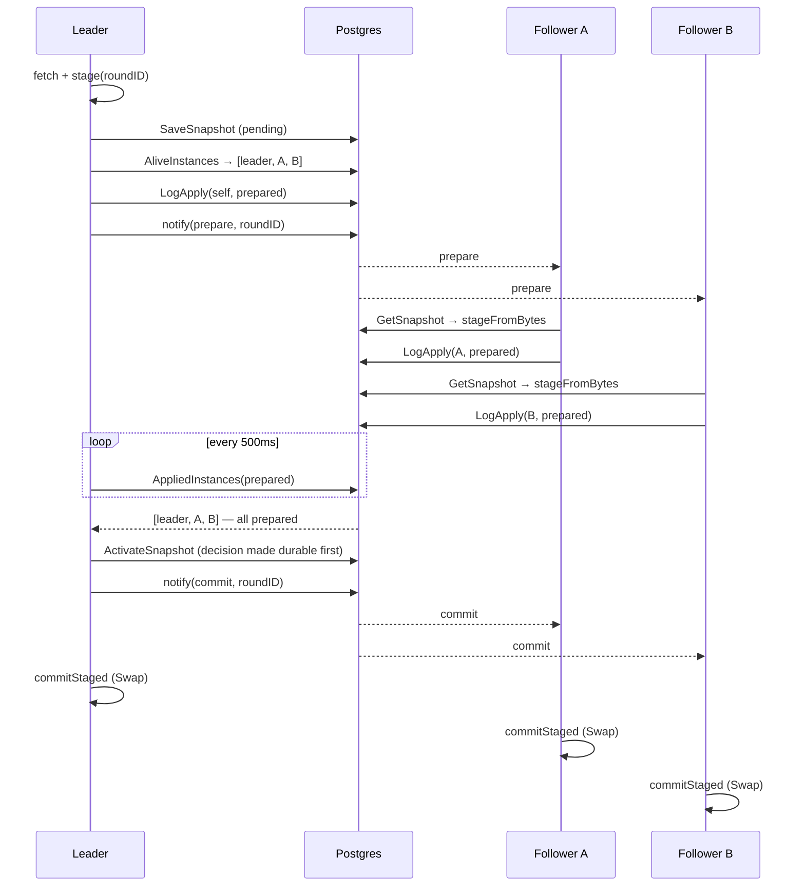

# Sync Protocol

This document explains how config changes propagate from the data source to all application replicas.

## Participants

- **Data Source** — the source of truth for all config data (e.g. Directus, custom API)
- **Leader** — the replica that holds the Postgres advisory lock; performs fetches from the source
- **Followers** — all other replicas; receive data via storage snapshots
- **Postgres** — stores snapshots, apply logs, advisory locks, and instance registry
- **Notify channel** — broadcasts sync/rollback events to every replica, the publisher included (Postgres LISTEN/NOTIFY or Redis Pub/Sub)

## Leader Election

Leader election uses a **Postgres session-level advisory lock** (`pg_try_advisory_lock`).

```
Replica A: pg_try_advisory_lock(987654321) → true  (leader)
Replica B: pg_try_advisory_lock(987654321) → false (follower)
Replica C: pg_try_advisory_lock(987654321) → false (follower)
```

- The lock is attempted at the start of each poll cycle
- If acquired → run leader protocol
- If not acquired → do nothing (follower reacts to notifications)
- Lock is held for the duration of one sync cycle, then released
- If the leader crashes, Postgres automatically releases the session lock

The advisory lock key is configurable via `Options.AdvisoryLockKey`. All instances of the same service must use the same key.

## Leader Protocol

On each poll cycle (default: every 5 minutes), the leader does this for each registered collection:

```
1. VERSION CHECK
   GET /items/{collection}?sort=-date_updated&limit=1&fields=date_updated
   → Parse max(date_updated) as new version
   → Compare with current in-memory version
   → If equal: skip (no change)
   → If older: decline the cycle (see Forward-Only Leader)

2. FETCH (no swap yet)
   GET /items/{collection}  (with configured fields, deep, filters)
   → Unmarshal into []T and hold it as a staged value; in-memory data unchanged

3. PERSIST
   INSERT INTO config_snapshots (collection, version, content, status='pending')

4. ACTIVATE
   UPDATE config_snapshots SET status='active' WHERE collection=$1 AND version=$2
   UPDATE config_snapshots SET status='inactive' WHERE collection=$1 AND status='active' AND version!=$2
   → The decision, made durable before it is applied or announced
     (see Decision Ordering)

5. APPLY
   Call Config[T].Swap(newVersion, items)
   → This atomically updates in-memory data + fires OnChange hooks + recomputes Views

6. NOTIFY
   pg_notify('config_sync', '{"action":"sync","collection":"businesses","version":"2025-01-02T00:00:00Z","instance_id":"<leader>"}')
   → Or Redis PUBLISH if using Redis notify channel
   → The leader receives this event back and drops it (see Event origin)

7. CACHE
   If cache enabled: write to Redis (sync or async based on strategy)

8. SELF-LOG
   INSERT INTO config_apply_log (instanceID, collection, version, 'applied')

9. WAIT FOR CONFIRMATIONS  (observational)
   Loop (500ms interval, 30s timeout):
     SELECT COUNT(*) FROM config_apply_log WHERE collection=$1 AND version=$2 AND status='applied'
     SELECT COUNT(*) FROM config_instances WHERE service_name=$1 AND last_heartbeat > NOW() - 30s
     → If applied_count >= alive_count: all replicas confirmed
     → On timeout: warn and move on. The snapshot is already active, so a
       laggard delays a log line, not the cluster.
```

## Forward-Only Leader

**A leader never announces a version older than the one it already holds.** The
version a non-forced cycle would move to has to be strictly newer, or the cycle is
declined: nothing is fetched, persisted, activated or announced, and the
collection stays where it is.

This is not a hypothetical guard. `source.FromDirectus` reports
`max(date_updated)` (falling back to `max(date_created)`), and **deleting the most
recently updated item lowers that maximum** — ordinary content editing, no fault
required. Without the guard the next cycle would activate and announce the older
version, and the cluster would split in two: replicas that receive the event
follow it, while a replica whose subscription buffer dropped the event refuses the
active row on every reconcile tick from then on, with no repair path for either
side.

The decline is reported, not hidden:

- `SourceMetrics.SourceVersionRegressed(collection)` — an optional interface a
  `Metrics` may also satisfy. Fires once per cycle, not deduped: it is the
  alerting signal.
- One `declining to sync a source version behind the one held` warn per reported
  version, with `local` and `reported`. Repeats are logged at Debug. The dedup
  resets once the collection applies a version again, so a recurrence is reported.

A declined cycle is **not** a failure: no `SyncFailed`, no `Status().LastSyncErr`,
nothing to retry. The source is simply not offering anything to move onto.

Consequences worth knowing:

- **A deletion that lowers the maximum is invisible to polling** until something
  in the collection is updated again. With WebSocket enabled it is not: the
  delete event triggers a forced sync, which mints a forward version (see
  [Forced sync](#forced-sync)). Poll-only deployments that delete content should
  expect one poll cycle of lag behind an edit, or run with WebSocket.
- **A source that always returns `time.Time{}`** syncs on first load and is then
  unchanged from the protocol's point of view (the reported version equals the
  held one, so the cycle is skipped as before, not declined). Only a forced sync
  moves it afterwards. Implement `LastModified` if you want polling to work.
- Moving a collection backwards remains an operator action — see
  [Rollback](#rollback).

## Decision Ordering

**A decision to move the cluster onto a new version is recorded durably before it
is announced or applied locally.** In practice: `ActivateSnapshot` runs before the
`sync` event (eventually-consistent mode) and before the `commit` event (2PC), and
before the leader's own `Swap`.

Two properties depend on it:

- `followerCatchUp` reconciles the local version against the **active** snapshot.
  Any window where storage still names the old version while replicas already
  hold the new one leaves the cluster reconciling against a version it is ahead
  of. Catch-up is monotonic, so that no longer reverts anyone — it now stalls the
  collection loudly instead: every replica refuses the active version on every
  tick, warns once per version, and counts `FollowerFailed`. Loud and stuck beats
  silent and reverted, but neither is acceptable, which is why the ordering
  stands.
- The leader's in-memory version must never run ahead of the active snapshot. If
  it did, a failed activation would leave the version check in step 1 skipping
  every later cycle — the snapshot would never be activated, and followers would
  stay pinned to the previous version while the leader serves the new one. This is
  why the local swap happens *after* activation: a failed activation drops the
  staged value and changes nothing, and the next cycle retries the same version
  from scratch.

## Event Origin

The notify transports are broadcasts: PostgreSQL LISTEN/NOTIFY and Redis Pub/Sub
deliver every event to every subscriber **including the instance that published
it**. De-duplication is the manager's job, not the transport's.

- The manager stamps `instance_id` on every event it publishes (`sync`,
  `prepare`, `commit`, `abort` — `rollback` is only ever published by an
  operator).
- An incoming event whose `instance_id` equals the local instance ID is logged at
  Debug and dropped. Without that filter the leader runs the whole follower path
  against its own broadcast: re-reading the snapshot it just wrote, re-validating
  and re-staging the payload it already holds, and consuming its own staged entry
  before the round gets to commit it.
- An event with **no** `instance_id` is processed normally. That is deliberate:
  operators and external tooling publish events (e.g. a `rollback`) without an
  instance identity, and during a rolling deployment replicas running older code
  publish without the stamp.

Implementations of `notify.Channel` must honour the broadcast contract; run them
against the `notify/notifytest` conformance suite.

## Follower Protocol

Followers listen on the notification channel. When they receive a sync event:

```
1. RECEIVE EVENT
   {"action": "sync", "collection": "businesses", "version": "2025-01-02T00:00:00Z", "instance_id": "<leader>"}
   → Dropped without further work if instance_id is our own

2. LOAD SNAPSHOT
   SELECT content FROM config_snapshots WHERE collection=$1 AND version=$2

3. APPLY
   Unmarshal content into []T
   Call Config[T].Swap(version, items)
   → Triggers OnChange hooks + View recomputes (same as leader)

4. LOG
   INSERT INTO config_apply_log (instanceID, collection, version, 'applied')
```

## Follower Catch-Up

Every replica that is not leader compares its in-memory version against the
**active** snapshot once per reconcile tick (`HeartbeatInterval`, default 10s) and
applies it when it is behind. This is the repair path for a lost notification —
see [Missed notifications](#missed-notifications).

**Catch-up only rolls forward.** An active snapshot naming a version older than
the one a replica holds is refused: the replica keeps serving what it has, emits
`FollowerFailed` with `manager.ErrActiveSnapshotBehind`, and warns
`refusing to move to an older active version` with `path=catch_up` — once per
active version, because the condition persists for as long as storage stays behind
and the check runs per config per tick. The dedup resets on the next successful
apply, so a recurrence is reported again. The metric is not deduped; it is the
alerting signal.

**The same guard covers incoming `sync` events** (`path=sync_event`). A leader
cannot announce a regression any more (see
[Forward-Only Leader](#forward-only-leader)), so this is defence in depth — but it
is the path that splits a cluster when something does: whoever receives the event
would follow it while whoever missed it refuses the active row forever.

This is containment, not correctness. Every replica reconciles against the same
`active` row, so one stale row is a cluster-wide instruction: without the guard, a
single leader-side ordering bug reverted 13 replicas within one tick, and any
future cause — a botched manual `UPDATE`, a half-applied migration — would do the
same. With the guard, the same causes leave the cluster serving the newer version
and alerting, which no amount of correct leader ordering can achieve on its own.

Refusals do not evict other per-version reports. Each report kind (validator
rejection, refused backward move, aborted 2PC round) keeps its own
one-per-version record, so a refusal on every tick cannot make a validator
rejection re-report the same bad version.

Two version comparisons exist for a reason: the local version is checked against
the cheap version probe *before* the snapshot content is loaded, then again
against the version actually about to be applied, since the probe and the content
read are two separate queries.

A **zero** local version always passes the guard. A replica that has loaded
nothing must be able to load whatever is active, including the
`0001-01-01T00:00:00Z` version that a source without a `LastModified` signal
produces — a version that is not "after" the zero value a fresh replica holds.

Moving a replica backwards is an operator decision, taken through a `rollback`
event. See [Rollback](#rollback).

## Single-Writer Invariant

All mutations of registered config state happen on **one** goroutine: the one
that calls `Start`, which runs the startup sequence and then the run loop. That
covers the leader path (poll tick, WS debounce, `SyncNow`), the follower path
(notify events), follower catch-up, and the expiry of staged 2PC values. Swaps
never overlap.

The Postgres advisory lock is not enough on its own. It serialises leader against
leader — across replicas and within one replica, because the lock holder keeps
its session for the lock's lifetime, so a second concurrent acquire fails — but
it says nothing about a leader sync racing the *same* replica's follower path.

This is a supported guarantee, not an implementation detail. Consumers assemble
cross-collection aggregates inside an `OnChange` hook: read collections A, B and
C, build one derived object, store it atomically. That is only correct while
swaps are serialised. With two concurrent hook runs, each observes a different
mix of collection versions, and the run that started first can finish last and
publish the staler assembly — silently, with no error anywhere.

Consequences:

- `SyncNow(ctx)` does **not** sync on the caller's goroutine. It hands a request
  to the run loop and returns immediately, so a webhook handler does not wait for
  the cycle. Its `ctx` is unused: the cycle runs under the context passed to
  `Start` and therefore dies with the manager, not with the request.
- Requests coalesce. The request channel has one slot, so a burst — a webhook
  fired once per updated collection during a bulk publish — collapses into the
  cycle already running plus at most one more. Queueing them would stall the
  loop: one cycle version-checks *every* registered config.
- A request made **before** `Start` waits in the buffer and is served when the run
  loop comes up. Syncing it inline would break the invariant, and dropping it
  would lose the only trigger a `ManualSyncOnly` deployment has: a service that
  wires `SyncNow` to a webhook accepts HTTP before `Start` is entered, and startup
  runs no sync of its own when storage already holds an active snapshot. Only
  calls made once the manager is shutting down are dropped, with a warning.
- Staged 2PC values expire on the run loop's reconcile tick, not on a timer of
  their own. A timer deleting a staged value from its own goroutine can take it
  out from under the commit that is about to apply it — that is how a leader used
  to lose the value it had just decided to commit. The cost is granularity: a
  staged value lives until the first reconcile tick after its `PrepareTTL`.
- The registry heartbeat runs on its **own** goroutine, at `HeartbeatInterval`,
  starting as soon as the instance is registered — before the bootstrap sync, not
  after it. It only touches `config_instances`, and it must not be delayed by a
  long cycle or by startup: peers drop an instance whose heartbeat goes stale from
  their 2PC target set, the registry's default stale threshold (30s) is no larger
  than `WaitConfirmationsTimeout`, and a strict-mode bootstrap can spend that
  timeout per collection. The goroutine has its own cancel — `run` also returns on
  paths that leave the context alive — and `Start` does not return until it has
  finished. If a heartbeat finds its row gone (maintenance GC deletes rows older
  than `InstanceRetention`), the instance re-registers: `Heartbeat` is an `UPDATE`,
  so a deleted row never comes back on its own and the replica would stay out of
  every target set. A replica on its way out does not re-register — `Stop`
  deregisters deliberately.
- Leader election and follower catch-up stay on the run loop and keep their
  `HeartbeatInterval` cadence — they mutate config state.
- While a cycle occupies the run loop, incoming notify events buffer in the
  transport channel (16 slots in both `notify/postgres` and `notify/redis`) and
  are dropped when it overflows. Follower catch-up repairs the state on its next
  tick; see the note under Instance Registry & Heartbeat.

## Startup Sequence

When a replica starts, it loads data in this priority order:

```
1. REGISTER + START HEARTBEAT
   INSERT INTO config_instances (instanceID, serviceName)
   → the heartbeat goroutine covers everything below: step 5 can take
     WaitConfirmationsTimeout per collection in strict mode

2. SUBSCRIBE TO THE NOTIFY CHANNEL
   LISTEN config_sync
   → From step 1 on, peers count this instance in their 2PC target set, and no
     transport replays an event published before the subscription existed
   → Events arriving during steps 3-5 wait in the subscription buffer and are
     handled when the run loop comes up

3. LOAD FROM CACHE (optional, if ReadThrough/ReadWriteThrough strategy)
   Redis GET director:{collection}
   → Fastest: no Postgres or Directus needed
   → May be stale in either direction (see below)

4. LOAD FROM STORAGE
   SELECT content FROM config_snapshots WHERE collection=$1 AND status='active'
   → Applied unless it names the version the cache already provided

5. INITIAL SYNC (leader only)
   Full leader protocol for all registered collections

6. START THE RUN LOOP
   poll ticker (default 5m), SyncNow requests, leader election and follower
   catch-up plus staged-value sweep (default 10s), notification listener,
   WS debounce
```

This means replicas can serve requests immediately after step 3 or 4, before Directus is even contacted.

**Step 2 comes before the loads and the initial sync on purpose.** A replica is a
target of every peer's 2PC round from its registration onward, so one that has not
subscribed yet costs those rounds an abort — it cannot answer a `prepare` it never
received. Subscribing first shrinks that window to the subscribe call itself; the
window cannot be closed entirely, because a replica that has subscribed still does
not *handle* events until step 6, so the bootstrap is retried (see below).

In `ManualSyncOnly` mode step 5 runs only when a config is still unloaded, and it is
retried on the reconcile tick for as long as that is true — manual mode means "pull
no changes from the source on a schedule", not "never come up at all". A config
counts as loaded once it has a version, which an empty source also produces, so a
collection that legitimately has no items stops the retry like any other.

**The active snapshot is canonical at startup; the cache is a fast path, not a
source of truth.** Step 4 overrides what step 3 loaded in *either* direction, and
only skips when both name the same version. The cache can be stale-forward — it
still names the version a rollback moved away from — and nothing later repairs
that: catch-up refuses to move backwards, so a pod that warm-started onto it would
serve the rolled-back-from config until a leader advances the collection, which is
exactly what a rollback freeze is holding off. When storage has no active snapshot
the cached value stays: that fallback is why the cache is read first.

## Sequence Diagram


```mermaid
sequenceDiagram
    participant L as Leader
    participant PG as Postgres
    participant FA as Follower A
    participant FB as Follower B

    L->>PG: pg_try_advisory_lock → true
    L->>L: fetch version from source
    L->>L: fetch items from source (staged, not applied)
    L->>PG: INSERT snapshot
    L->>PG: UPDATE status=active (decision made durable first)
    L->>L: Config.Swap() (local apply)
    L->>PG: pg_notify(sync)
    L->>PG: INSERT apply_log (applied)
    PG-->>FA: notification
    PG-->>FB: notification
    FA->>PG: SELECT snapshot
    PG-->>FA: content
    FA->>FA: Config.Swap()
    FA->>PG: INSERT apply_log (applied)
    FB->>PG: SELECT snapshot
    PG-->>FB: content
    FB->>FB: Config.Swap()
    FB->>PG: INSERT apply_log (applied)
    L->>PG: COUNT(applied) >= COUNT(alive) → confirmed
    L->>PG: pg_advisory_unlock
```

## Rollback

A confirmation timeout does **not** roll anything back: the snapshot is already
active by then (see Decision Ordering), and reverting an already-announced version
is not a decision the protocol can make on its own.

Rollback is operator-driven, and it is the **only** way a replica moves to an
older version: follower catch-up rolls forward only, incoming `sync` events are
held to the same rule, and a leader declines a source version behind the one it
holds. Activate the target snapshot, then publish a `rollback` event on the notify
channel without an `instance_id`; every replica loads the current `active`
snapshot and swaps to it in either direction, the current leader included. The
event's `version` field is ignored: the `active` row decides, which is why it must
be flipped first. Each replica logs the apply at Warn (overriding the monotonic
guard has to be visible) and records apply-log status `rolled_back`, so one query
confirms the rollback landed everywhere.

Each replica also rewrites its own cache entry from the active snapshot it just
applied. Without that, the cache would keep naming the version being rolled back
from and the next pod to start would warm from it — and nothing else can fix it
during the procedure, because the leader-side cache repair needs a lock holder and
the procedure holds the lock. Every replica writes the same bytes (the active
snapshot's), so the writes converge. Under a read-only cache strategy nothing is
written, as usual.

The library never publishes `rollback` itself. That is what makes it a clean
operator channel.

A rollback is not durable on its own. It changes what replicas hold and what the
`active` row names, but not the source: while the source still reports a newer
`LastModified`, the next leader cycle re-fetches, re-activates and re-announces
the version you just rolled back from, within one reconcile tick. Reverting the
cluster therefore means stopping the roll-forward as well — either fix the source,
or hold the advisory lock so no replica can become leader.

Nothing else is torn down. The event is handled on the run loop, so it cannot
interleave with a leader round on the same replica, and a staged value from a 2PC
round in flight is left alone on purpose: a replica that logged `prepared` must
honour the matching `commit`, or strict mode stops being unanimous.

**The full procedure, with the SQL and the verification queries, is in
[docs/rollback-runbook.md](rollback-runbook.md).**

## Instance Registry & Heartbeat

Each replica registers itself in `config_instances` and sends heartbeats every 10 seconds, on a goroutine of its own that starts with the registration and covers the whole startup sequence (see Single-Writer Invariant). The leader uses `AliveCount` (instances with heartbeat newer than 30s) to know how many confirmations to expect.

If a replica dies without deregistering, its heartbeat goes stale and it's excluded from the confirmation count within 30 seconds.

A heartbeat that finds no row re-registers the instance, and only then — `Heartbeat` is an `UPDATE`, so once maintenance GC has removed a row whose heartbeat lagged past `InstanceRetention`, nothing else brings the replica back into `AliveInstances`, and strict-mode rounds would keep excluding a live replica that may still be serving stale config.

The instance ID must be unique per replica. It stamps every published event, and a replica drops events carrying its own ID, so two replicas sharing an ID drop each other's events and config stops flowing between them. `Start` warns when the registry already holds a live row for the ID — expected after a restart that reuses it, a misconfiguration otherwise.

### Missed notifications

The subscription channel returned by `notify.Channel.Subscribe` buffers 16
events. While the run loop is busy — a long cycle, a slow source — events pile up
there, and on overflow `notify/postgres` drops the event with a warning while
`notify/redis` stalls its reader until go-redis drops the message from its own
buffer. Either way events are lost, so no part of the protocol may depend on
seeing all of them:

- A missed `sync` leaves a follower stale until the next follower catch-up tick,
  which compares the local version with the active snapshot and applies it when
  it is newer.
- A missed `rollback` is **not** repaired. Catch-up will not move a replica
  backwards, so that replica keeps serving the version the operator is reverting
  away from until the event is re-published. The runbook's verification step is
  what catches this.
- A missed `prepare` costs the round: the follower never logs `prepared`, the
  leader times out and aborts, and it retries on the next cycle. No replica
  applies a version the others did not.
- A missed `commit` or `abort` leaves a staged snapshot behind, which the run
  loop drops on the first reconcile tick after `PrepareTTL`. The commit decision
  is already durable in
  `config_snapshots`, so follower catch-up moves the replica onto the new version
  on its next tick.

Catch-up is what makes dropped events survivable, and it runs on the run loop —
so repair happens after the cycle that caused the backlog finishes, not during.

## WebSocket-Triggered Sync

When `WithWebSocket(ws)` is configured, the manager subscribes to Directus WebSocket events for all registered collections. Each subscription uses a UID (`sub_{collection}`) to map events back to collections (Directus WS events don't include the collection name).

### How it differs from polling

| Aspect | Poll-based | WebSocket-triggered |
|---|---|---|
| Latency | Up to PollInterval (default 5m) | Near-instant |
| Version check | Fetches `max(date_updated)`, skips if unchanged | **Forced sync** — skips version comparison |
| Poll interval | Normal (5m) | Safety-net only (15m) |
| Failure mode | Continues polling | Falls back to normal polling |

### Forced sync

When a WebSocket event arrives, we **know** something changed — no need to compare versions. The forced sync:

1. Fetches the current version (still needed for snapshot labeling)
2. **Skips** the "is version equal?" check
3. Full fetch → snapshot → activate → swap → notify (same as regular sync)

This is critical because `date_updated` may not be populated for items created via the API when the special metadata isn't applied (a known Directus 11 quirk with API-created fields).

**A forced cycle mints its version from the clock whenever the source has no
forward one to offer** — the zero timestamp above, and the lower
`max(date_updated)` a deletion leaves behind. The event says the content changed
but not what it changed to, so the new content gets a version the cluster can
move onto instead of an announcement everyone else has to refuse (see
[Forward-Only Leader](#forward-only-leader)). The only case a forced cycle
declines is a held version *ahead of this replica's clock* — a future-dated
`date_updated` or a badly skewed node — where no forward version can be minted
and stalling loudly is the safe answer.

### WS event format

Directus sends subscription events as:

```json
{
    "type": "subscription",
    "uid": "sub_businesses",
    "event": "create",
    "data": [{"id": 1, "name": "New Item", ...}]
}
```

The `init` event (subscription confirmation) is filtered out. Only `create`, `update`, and `delete` events are processed.

### Fallback behavior

If the WebSocket connection drops:
1. The WS channel closes
2. Manager sets `wsEvents = nil` (disables the select case)
3. Poll ticker resets to normal `PollInterval`
4. No panics, no goroutine leaks — seamless fallback

## Two-Phase Commit Mode (strict consistency)

The default sync protocol is **eventually-consistent**: a slow or broken follower cannot block the leader from advancing, so different replicas may briefly (or, if data stops changing, indefinitely) run on different versions.

For workloads that require the cluster-wide invariant *"at any moment every alive replica runs the same config version"*, opt in to **two-phase commit** via `Options.RequireUnanimousApply = true`.

### Guarantee

- Either **all** alive replicas transition `vN → vN+1`, or **nobody** does.
- A broken replica cannot permanently diverge.
- There is a brief skew window (fractions of a second up to a few seconds) between when the leader publishes `commit` and each follower actually performs its local `Swap()`. This is inherent to distributed systems — *true* simultaneity requires synchronized clocks + scheduled activation time.

### Trade-off

- **A single chronically-broken replica blocks ALL config updates cluster-wide.** The leader retries on each poll / WS cycle but will keep aborting until every replica can prepare.
- Dead replicas that have not deregistered (kill −9, OOM, network partition) block progress for up to `registry.staleThreshold` (default 30 s) after their last heartbeat, because they still appear in `AliveInstances` during that window.
- **Mixed-mode clusters are unsupported.** Every replica of the same service must agree on `RequireUnanimousApply`. A mix of 2PC and eventually-consistent managers will violate the invariant.

### Protocol

On each leader round (poll or WS-triggered), for each collection:

```
1.  VERSION CHECK            same as eventually-consistent mode
2.  STAGE (no swap yet)
    - Leader fetches all items, serializes, stores in-memory staged slot
      keyed by a fresh roundID; in-memory config is NOT updated yet.
3.  PERSIST SNAPSHOT
    INSERT INTO config_snapshots (..., status='pending')
3a. RESET APPLY LOG
    DELETE FROM config_apply_log WHERE collection=... AND version=...
    - Wipes any stale 'prepared'/'committed' rows from a prior aborted
      round of the same version. Safe under the advisory lock.
4.  TARGET SET
    - Leader records AliveInstances(service) as the target set.
    - Leader self-logs "prepared" in config_apply_log.
5.  PUBLISH PREPARE
    pg_notify('{"action":"prepare","collection":...,"version":...,"round_id":...,"instance_id":...}')
6.  WAIT FOR PREPARES (loop every 500ms until WaitConfirmationsTimeout)
    - alive    = AliveInstances(service) re-snapshotted every tick
    - failed   = AppliedInstances(collection, version, 'prepare_failed')
    - prepared = AppliedInstances(collection, version, 'prepared')
    - If any (target ∩ alive) replica is in failed → abort immediately
    - If every (target ∩ alive) replica is in prepared → proceed
    - On timeout → abort
7a. ON ABORT
    - Publish {"action":"abort","round_id":...}
    - Followers discard staged snapshot
    - Leader marks snapshot as 'failed' — unless the active version in
      storage is the version it just tried to activate, or cannot be read
      at all. ActivateSnapshot is transactional, but a transaction that
      commits server-side can still surface as a client error; failing
      that snapshot would demote the collection's only active snapshot,
      and a replica restarting in that window comes up with no config.
      Such a snapshot is left in place and the next cycle re-activates it.
    - Leader returns error; next poll/WS cycle will retry
7b. ON COMMIT
    - ActivateSnapshot → THIS is the commit decision point, and it is made
      durable before it is announced or applied (see Decision Ordering).
      If activation fails the round aborts exactly like 7a
      (StagedDropped reason 'activate_failed') and nobody commits.
    - Publish {"action":"commit","round_id":...}
    - Leader swaps staged value live, logs 'committed'. config.Swap publishes
      the value before it runs consumer OnChange hooks, so a hook that panics
      leaves the value live and the round committed; that is logged as a
      warning. Nothing else can drop the staged value in between — expiry,
      aborts and follower commits all run on the same goroutine as the round
      (see Single-Writer Invariant).
    - Cache write happens AFTER commit (an aborted round never warms cache)
    - Publish {"action":"sync"} as a fallback for replicas that missed
      the commit event
```

Apply-log statuses in 2PC: `prepared`, `prepare_failed`, `committed`. An aborted
round writes no `committed` row for its version, which is what tells a committed
round apart from one that never committed. `ResetApplyLog` clears the statuses at
the start of the next round for the same version.

### Follower handlers

- `prepare` → load snapshot from storage, deserialize into a staged slot keyed by `roundID`, log `prepared` or `prepare_failed`. Staged slots have a TTL (default `2 × WaitConfirmationsTimeout`) after which they're dropped.
- `commit` → swap the staged value live under the matching `roundID`. If the staged slot is missing (TTL expired, manager restart), fall back to reloading from storage — the follower already committed to the invariant when it logged `prepared`.
- `abort` → drop the staged slot. No apply-log entry is written (an aborted round leaves no trace except the `failed` snapshot).

### Why target-by-instance-id (not AliveCount)

The legacy protocol uses `AliveCount`. For 2PC that's insufficient: a replica that gets SIGKILLed continues to appear in the registry for up to `staleThreshold`. With count-based comparisons the leader would wait for a phantom, time out, and abort every round during that window.

The 2PC protocol snapshots `AliveInstances → []instanceID` at round start and checks *per instance* on every tick. If an instance disappears from `AliveInstances` during the wait (heartbeat went stale), it drops out of the effective target. The round completes as long as all *currently* alive members of the target set have prepared.

### Startup

`loadFromCache` / `loadFromStorage` are unchanged — they load the last `active` snapshot, which under 2PC is always a fully committed version. A replica that joins mid-round sees only the pre-round active version until it subscribes and participates in the next round.

### Configuration

```go
manager.Options{
    ServiceName:              "my-service",
    RequireUnanimousApply:    true,                     // opt in
    WaitConfirmationsTimeout: 10 * time.Second,         // prepare timeout (default: 30s)
    PrepareTTL:               30 * time.Second,         // follower staged TTL (default: 2 × WaitConfirmationsTimeout)
}
```

### Sequence diagram (2PC, happy path)


```mermaid
sequenceDiagram
    participant L as Leader
    participant PG as Postgres
    participant FA as Follower A
    participant FB as Follower B

    L->>L: fetch + stage(roundID)
    L->>PG: SaveSnapshot (pending)
    L->>PG: AliveInstances → [leader, A, B]
    L->>PG: LogApply(self, prepared)
    L->>PG: notify(prepare, roundID)
    PG-->>FA: prepare
    PG-->>FB: prepare
    FA->>PG: GetSnapshot → stageFromBytes
    FA->>PG: LogApply(A, prepared)
    FB->>PG: GetSnapshot → stageFromBytes
    FB->>PG: LogApply(B, prepared)
    loop every 500ms
        L->>PG: AppliedInstances(prepared)
    end
    PG-->>L: [leader, A, B] — all prepared
    L->>PG: ActivateSnapshot (decision made durable first)
    L->>PG: notify(commit, roundID)
    PG-->>FA: commit
    PG-->>FB: commit
    L->>L: commitStaged (Swap)
    FA->>FA: commitStaged (Swap)
    FB->>FB: commitStaged (Swap)
```

### Rolling Deployments

2PC is sensitive to instance churn. During a rolling update, dying pods remain in `AliveInstances` until their heartbeat goes stale (`staleThreshold`, default 30s). The leader includes them in the prepare target set, they don't respond, and the round aborts on timeout.

With 15 pods and `MaxUnavailable=1`, this can block all config updates for the duration of the rollout.

**Mitigation:** call `manager.Stop()` on `SIGTERM`. Stop deregisters the instance from the registry **before** stopping the event loop, removing it from `AliveInstances` immediately. This reduces the phantom window from 30s to effectively zero.

See [rolling-deployment.md](./rolling-deployment.md) for full guidance.

### Observability

Implement the 2PC-specific `Metrics` methods to track round health:
- `PreparePhaseStarted(collection, roundID)` / `PreparePhaseSucceeded` / `PreparePhaseFailed(reason)` — reason is `"prepare_failed"` or `"timeout"`.
- `FollowerPrepared(collection)` / `FollowerPrepareFailed(collection, err)` — per-follower prepare outcomes.
- `StagedDropped(collection, reason)` — reason is `"abort"`, `"ttl"`, `"timeout"`, `"prepare_failed"` or `"activate_failed"` (snapshot activation failed, round aborted).

### What to alert on

Every failure mode below is designed to stop and wait for a person rather than guess.
That only works if the person is told, so treat these as required, not optional:

- `SyncFailed` — a round did not complete. Under `RequireUnanimousApply` the cluster
  stays on the previous version until someone triggers a new sync.
- `PreparePhaseFailed` with reason `"timeout"` — one chronically unhealthy replica
  blocks updates cluster-wide, and this is the only signal that says so.
- `FollowerFailed` with `ErrActiveSnapshotBehind` — a replica holds a version newer
  than the active snapshot and will not move down on its own. Expected briefly during
  a rollback; sustained means a replica missed the announcement.
- `SourceVersionRegressed` (optional `SourceMetrics`) — the source reported a version
  older than the one held, so the cycle declined it. Nothing will retry until the
  source moves forward or a person acts.
- In-memory version differing from the active snapshot for longer than a few reconcile
  intervals. There is no metric for this; compare `Status().Configs[].Version` against
  `config_snapshots`. It is the symptom every one of the failures above ends in, so it
  is worth alerting on directly.

## Maintenance: garbage-collecting old data

By default, snapshots and registry rows accumulate forever — `director` keeps
the full history so any replica can recover an arbitrary version, and dead
replicas that never called `Deregister` linger in `config_instances` until
manually cleaned.

For long-running clusters, opt into periodic garbage collection via
`manager.Options`:

```go
manager.Options{
    ServiceName:         "my-service",
    SnapshotRetention:   90 * 24 * time.Hour, // keep snapshots ~3 months
    InstanceRetention:   24 * time.Hour,      // prune dead replicas after 1 day
    MaintenanceInterval: time.Hour,            // run GC hourly (default)
}
```

### Behavior

- A maintenance ticker fires every `MaintenanceInterval`. Only the leader
  (the manager that holds the advisory lock at that instant) actually performs
  the deletes — followers see `ErrLockNotAcquired` and exit immediately, so
  there is no stampede.
- **Snapshots:** every snapshot whose `created_at < now() - SnapshotRetention`
  AND `status != 'active'` is removed. Apply-log rows for the deleted snapshot
  versions are removed in the same transaction. The currently-active snapshot
  is **always** preserved regardless of age, so the cluster can always recover
  the authoritative version (e.g. after a restart that loses cache).
- **Instances:** every row in `config_instances` whose `last_heartbeat <
  now() - InstanceRetention` is removed. `AliveCount` / `AliveInstances`
  already filter by their own (much shorter) staleness window for sync
  correctness, so this only affects long-dead rows.
- Setting either retention to `0` (the default) disables that GC; setting both
  to `0` skips creating the maintenance ticker entirely.

### Choosing values

- `SnapshotRetention` should be at least a few times your typical operational
  rollback window. With 5-minute polls and frequent updates you may produce
  hundreds of snapshots per day; 90 days strikes a balance between the ability
  to investigate old states and database bloat.
- `InstanceRetention` must be **far** larger than `HeartbeatInterval` (default
  10s) and the registry stale threshold (default 30s) — pick at least 1 hour
  to be safe against transient delays. The active sync protocol uses its own
  staleness window, so this value only controls how long dead rows stick
  around for inspection / accounting.

### Mocks

Custom `storage.Storage` and `registry.Registry` implementations must
implement `DeleteOldSnapshots(ctx, olderThan)` and `DeleteStaleInstances(ctx,
olderThan)` respectively. A no-op implementation (return `0, nil`) is safe if
you don't want GC for that backend.
